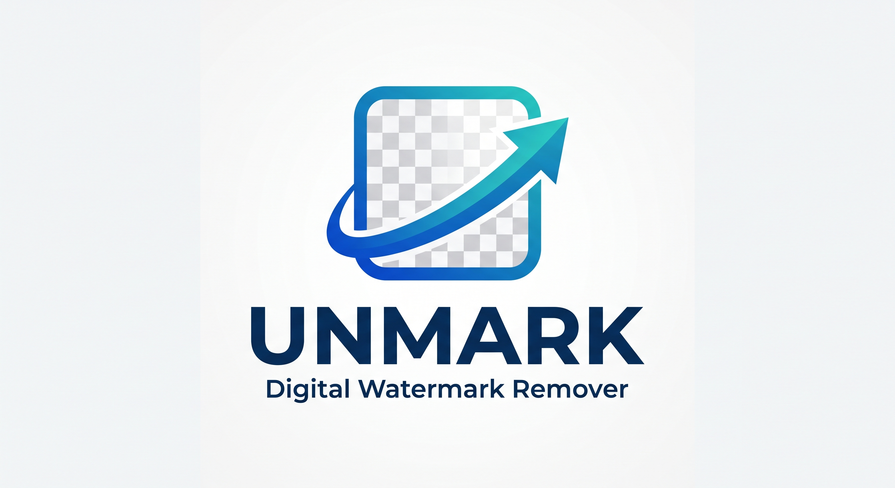
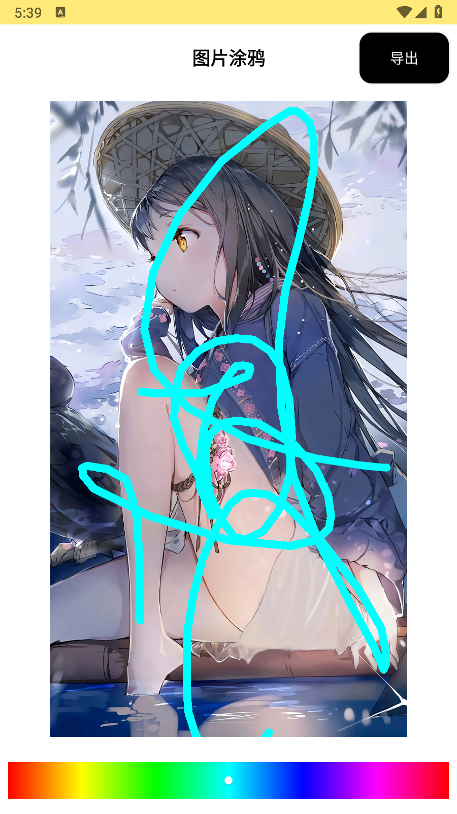
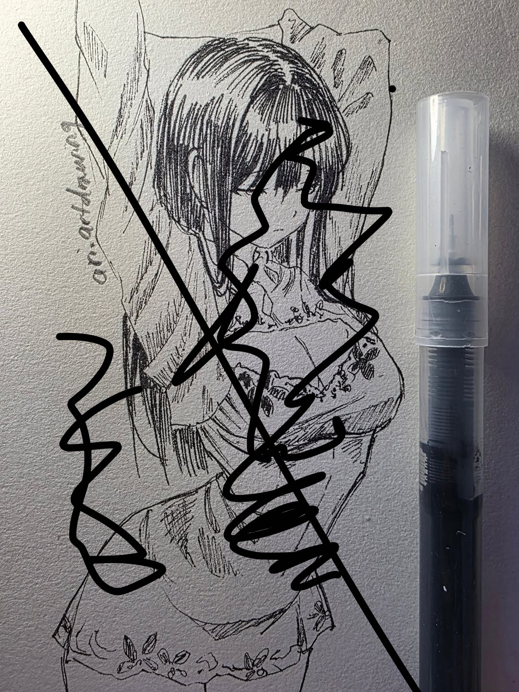
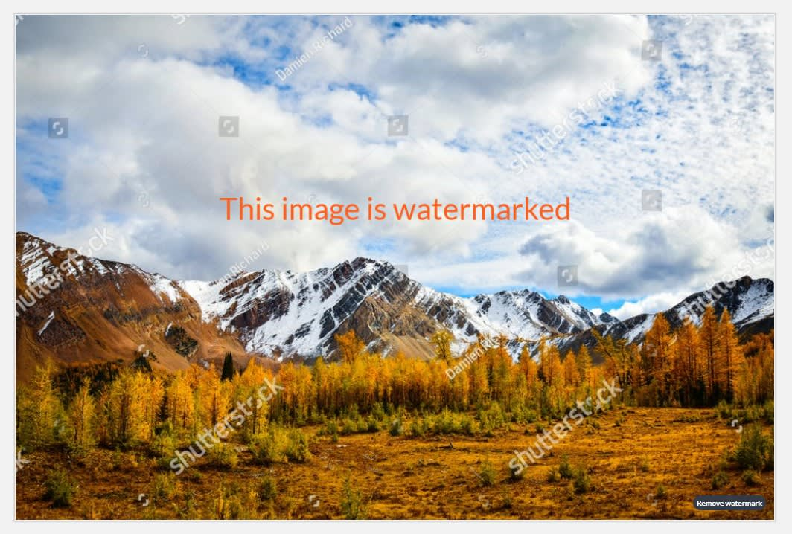
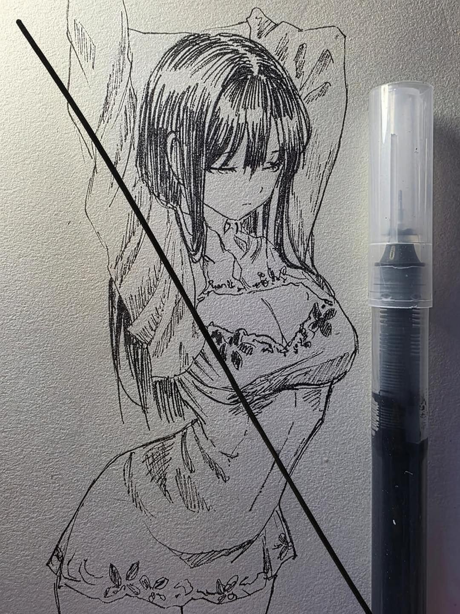
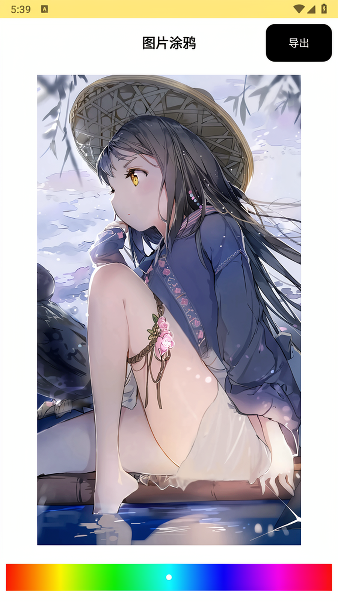
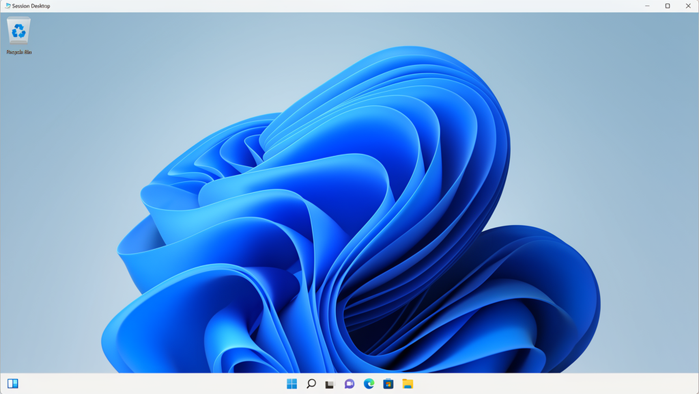
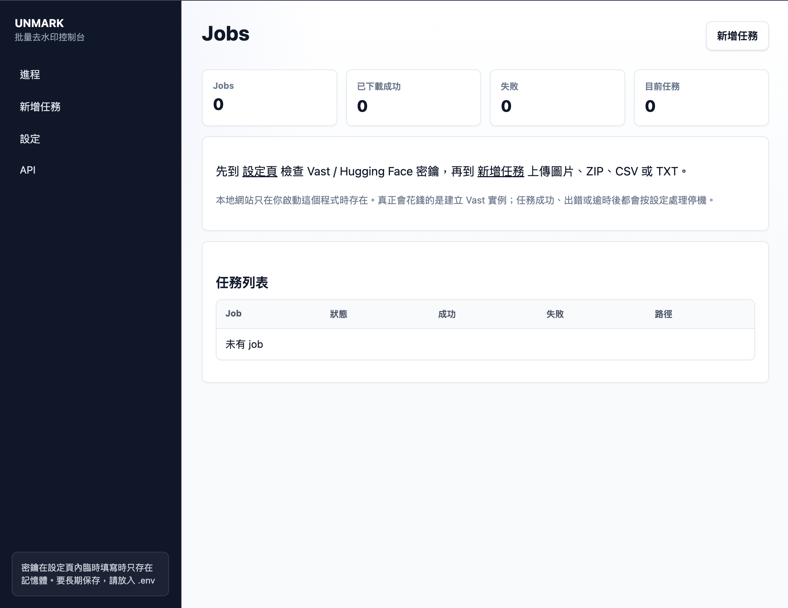
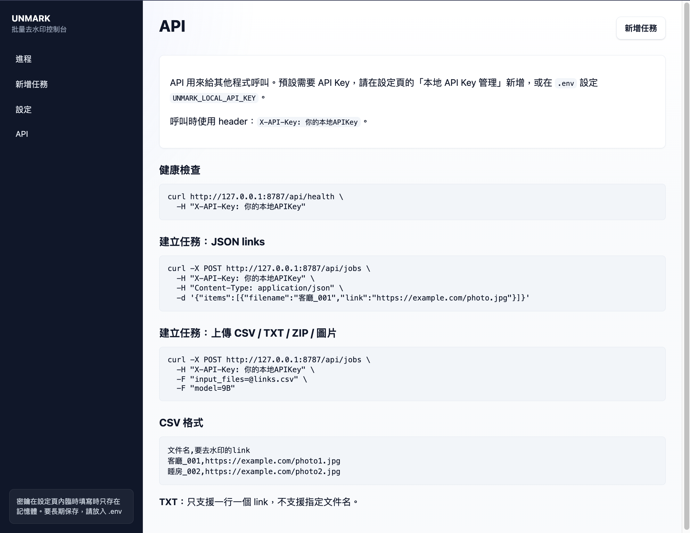

# UNMARK

UNMARK 是一個在本機控制 Vast.ai GPU 的批量圖片去水印工具，提供 LocalWeb、CLI 及受 API Key 保護的本地 API



**⚠️注意⚠️： UNMARK 主要供大量圖片批次處理。雲端 GPU 的環境準備、模型載入、儲存及傳輸均有成本；只處理少量圖片時，每張圖片的平均成本很高，不建議一般個人用戶為此開機。**

該項目由我從 Homedash(.hk) 公司中獨立出來，公司非常棒 ～ 同事們也很好。

很感謝 Wilson(CTO)、Bansen(BE) 提供的思路和方案，也很感謝公司其他的同事們！

<!-- 如 Herry、Tiekui、Tom、Walter 們 -->

還有 —— EDDIE !!! => https://eddie-lee.com/ <= 他是一個很好的人！是一個有涵養與遠見、有格局有膽識的人。和他相處總是很舒服，他是一個很好的Boss，Eddie ——「我們愛戴你」:D

## 效果展示

### ⚠️須知⚠️

1. **你必須知道，有時候「9B模型 不一定比 4B 好」。有時候「提示詞」也佔了很大一部分的功勞**。你可以修改/自訂提示詞，`Prompts`目錄內的 `.md` 檔案是提示詞；你可以直接創建新的MD(Markdown)檔案，檔名就是選項名稱。

2. 你會發現 **圖片變模糊**，因為「.env」默認設置 `UNMARK_MAX_SIDE=1024`，意味著「如果原圖大於1024px」。程式會先把最長邊縮至1024px，處理後再放大回原尺寸，導致丟失的細節不會自動恢復。你可以這樣改：

    - 普通高清圖：UNMARK_MAX_SIDE=1536

    - 2K 圖片：UNMARK_MAX_SIDE=2048
    
    **代價是更慢、更貴，亦會增加顯存用量。若原圖本身最長邊不超過1024px，提高此設定通常沒有任何畫質幫助**

### 去水印前

亂塗亂畫：




很難看出來的LOGO：


滿屏統一水印：


滿屏水印：


### 去水印後 - 提示詞有問題(失敗案例)

使用了 `9B`模型、8Steps + “萬能提示詞”

亂塗亂畫有一大筆沒去乾淨


LOGO去掉了，一些細節也沒有了：


### 去水印後

下面均使用 `9B`模型、8Steps，但是「提示詞」針對性用了不同的

萬能 提示詞：


亂塗亂畫 提示詞：


線稿粗黑筆 提示詞：


二維碼 提示詞：


Logo 提示詞：


---

## 快速開始

需要 Python 3.10 或以上、[Vast.ai](https://vast.ai/) API Key 及 [Hugging Face](https://huggingface.co/) Token。

首次設定可參閱 [基礎服務註冊](Docs/basic_services.md)。

```bash
python3 -m venv venv
source venv/bin/activate
python -m pip install -r requirements.txt
cp .env.example .env
```

在 `.env` 填寫：

```env
VAST_API_KEY=你的_Vast_API_Key
HF_TOKEN=你的_Hugging_Face_Token
```

啟動 LocalWeb：

```bash
python run_unmark.py serve-local
```

然後開啟 [http://127.0.0.1:8787](http://127.0.0.1:8787)。如不想把雲端密鑰寫入 `.env`，可在設定頁臨時輸入；臨時密鑰只會保留在目前程序的記憶體。



## 輸入格式

LocalWeb 接受圖片、ZIP、CSV 及 TXT。CSV 欄位如下：

```csv
文件名,要去水印的link
客廳_001,https://example.com/photo1.jpg
```

範本見 [input.csv.example](input.csv.example)。TXT 每行只放一個圖片網址，輸出檔名由程式產生。

## LocalWeb API

設定頁可以建立多個本地 API Key，並以備註分辨用途。Key 由系統隨機生成，建立後只顯示一次，請透過 `X-API-Key` 請求標頭使用。

設定頁建立的 API Key 只存在記憶體；如要在重啟後繼續使用，須把 Key 寫入專案根目錄的 `.env`：

```env
UNMARK_LOCAL_API_KEY=你的本地_API_Key
```

API 請求會按設定建立 Vast 實例、上傳輸入、執行處理及下載結果。格式及端點見 [LocalWeb、API 與匯入匯出](Docs/local_web_api.md)。



## CLI

先規劃任務，不建立 Vast 實例：

```bash
python run_unmark.py plan --input-csv input.csv
```

正式執行：

```bash
python run_unmark.py run --input-csv input.csv
```

查看、補下載及恢復任務：

```bash
python run_unmark.py status --job-dir jobs/<job-id>
python run_unmark.py reconcile --job-dir jobs/<job-id>
python run_unmark.py resume --job-dir jobs/<job-id>
```

## 模型與提示詞

內置模型快捷鍵為 `9B`、`4B`、`KONTEXT` 及 `KWR`。不設定 steps 時，程式會讀取 `model_presets.json` 內該模型的 `default_steps`。實測中較高 steps 並不保證品質更好，請先用少量樣本評估。

```bash
python run_unmark.py --list-models
python run_unmark.py --list-prompts
```

提示詞由 [Prompts](Prompts/) 內的 `.md` 檔案載入，預設為 `萬能提示詞`。新增 `.md` 檔案後，LocalWeb 會自動顯示新的提示詞選項。詳見 [提示詞選擇](Docs/prompt_presets.md)。

## 任務保護

- 每張成功圖片會即時下載，不必等待整批完成。
- 例外、逾時或未知錯誤時，程式會先嘗試補下載遠端已完成結果，再銷毀 Vast 實例。
- 任務狀態及輸出以原子方式寫入 `jobs/<job-id>/`，可用 `reconcile` 或 `resume` 接續。
- 成功後預設銷毀實例；只停止而不銷毀仍可能繼續收取儲存費。

詳見 [任務、恢復與停機](Docs/reliable_jobs.md)。

## 腳本模式

工程用戶可把圖片、ZIP、CSV 或 TXT 放入 `all_to_once_script/import/`，再執行：

```bash
python all_to_once_script/run_all_to_once.py
```

輸出會整理到 `all_to_once_script/export/`。個別匯入、執行及匯出命令見 [操作文件](Docs/local_web_api.md#all_to_once_script)。

## 文件

| 文件 | 內容 |
|---|---|
| [Docs/basic_services.md](Docs/basic_services.md) | Vast.ai、Hugging Face 及密鑰設定。 |
| [Docs/local_web_api.md](Docs/local_web_api.md) | LocalWeb、API、CSV/TXT 及腳本模式。 |
| [Docs/reliable_jobs.md](Docs/reliable_jobs.md) | 任務目錄、補下載、恢復及停機。 |
| [Docs/prompt_presets.md](Docs/prompt_presets.md) | 內置與自訂提示詞。 |
| [Docs/Models/README.md](Docs/Models/README.md) | 模型資料、成本及品質評測。 |
| [Docs/Examples/failures/README.md](Docs/Examples/failures/README.md) | 已知品質失敗案例。 |

## 專案結構

```text
UNMARK/
├── src/unmark/             # CLI、LocalWeb 及任務控制
├── tests/                  # 不連接 Vast 的自動化測試
├── Prompts/                # 提示詞檔案
├── Docs/                   # 文件、模型報告及展示素材
├── all_to_once_script/     # 腳本模式
├── input_images/           # 本地圖片輸入
├── output_images/          # 本地評測輸出
├── remote_worker.py        # 遠端 GPU 推理程式
├── model_presets.json      # 模型快捷鍵
├── run_unmark.py           # 執行入口
└── .env.example            # 環境變數範本
```

`jobs/`、`localweb_uploads/`、`.env`、本地設定 JSON 及實際輸出均已加入 `.gitignore`，不應提交到 Git。

## 授權與使用

UNMARK 程式碼採用 [MIT License](LICENSE)。模型權重由各自的作者提供並使用獨立授權；`9B`、`KONTEXT` 及 `KWR` 的底座模型設有非商業授權，`4B` 則標示為 Apache License 2.0。詳情見 [模型授權](Docs/Models/model_presets_summary.md#模型授權)。

只應處理你擁有或已獲授權修改的圖片，並自行遵守適用法律、模型條款及第三方權利。
